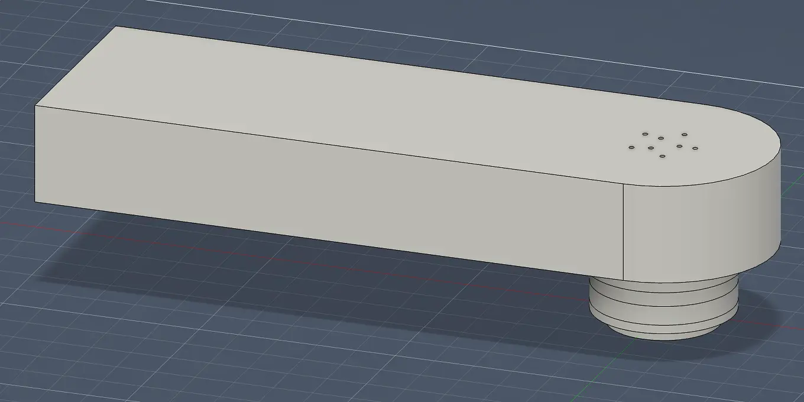
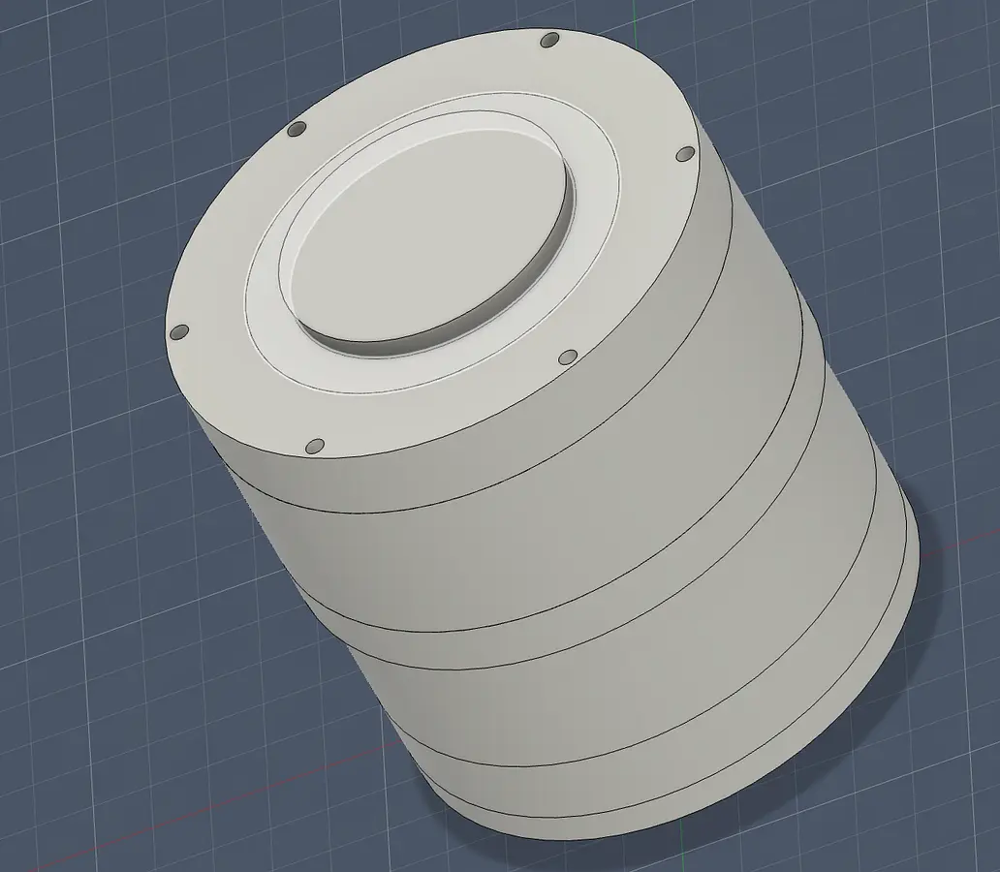
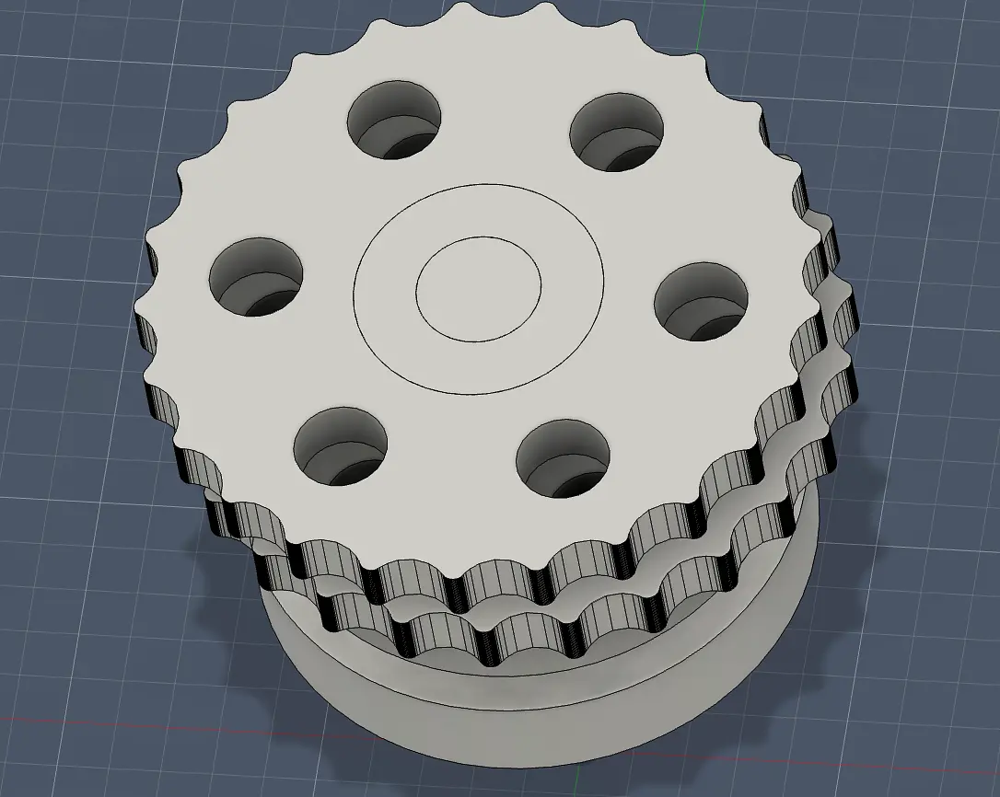
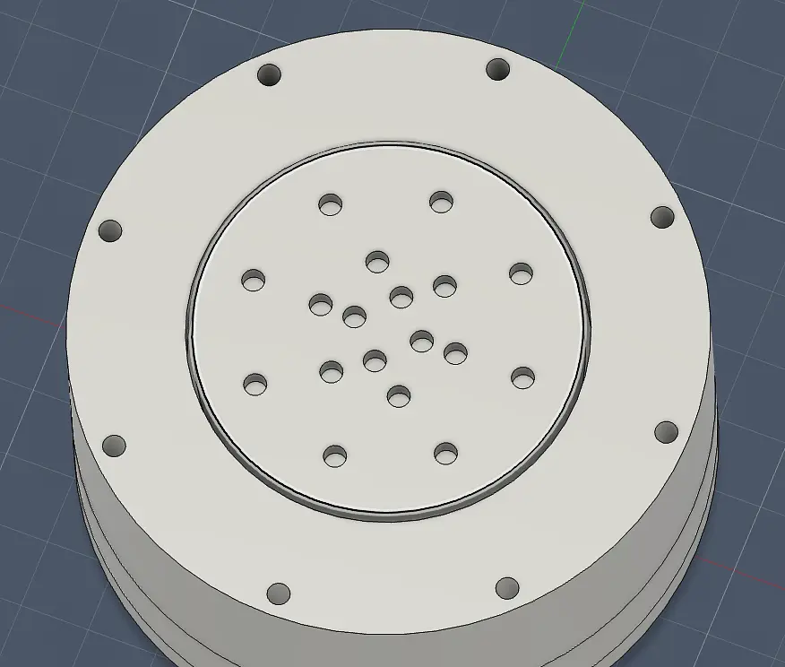
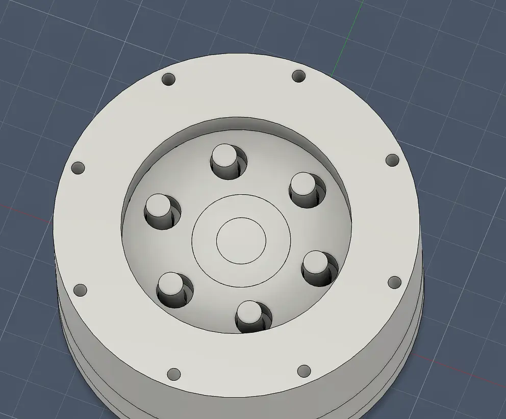
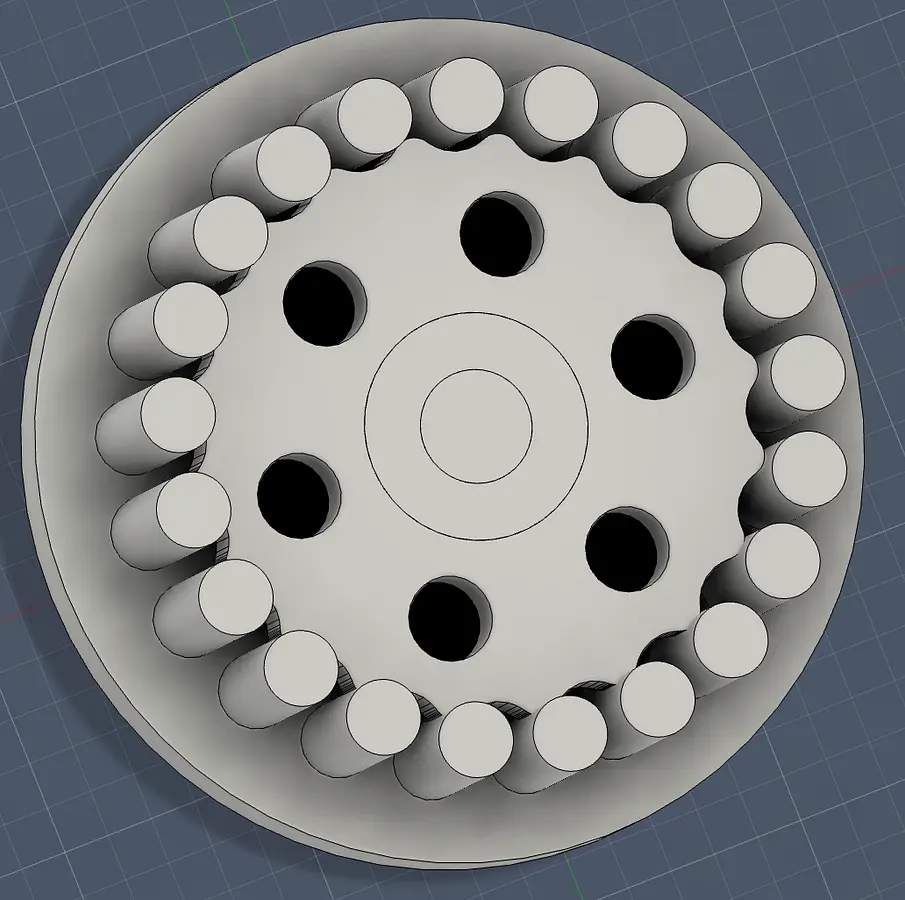
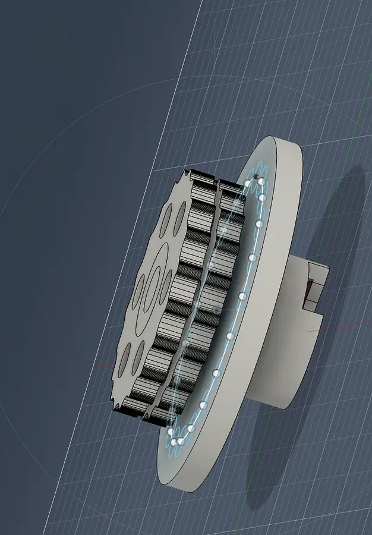
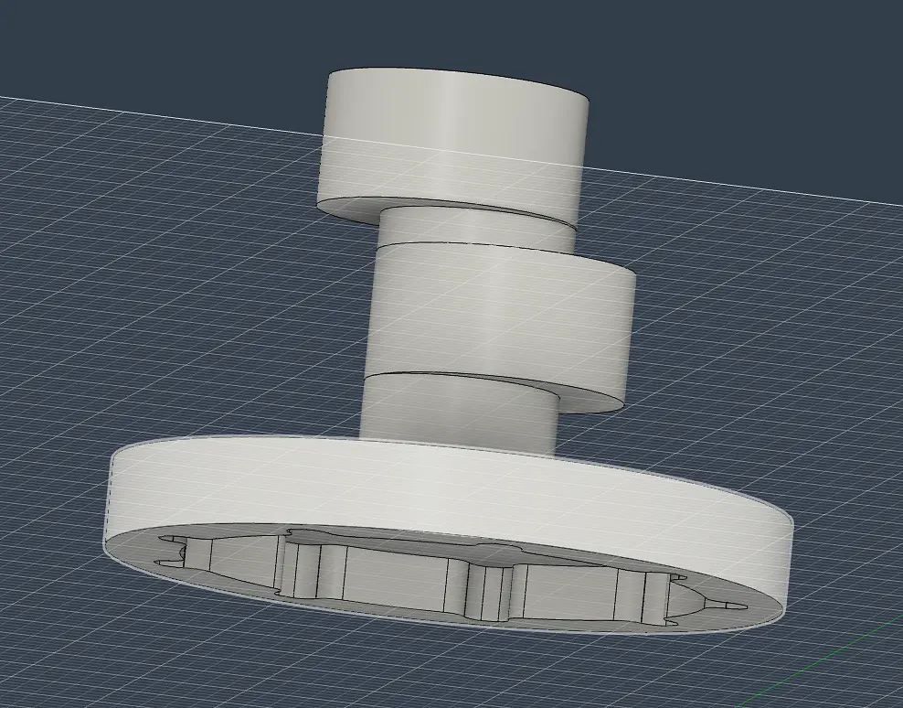
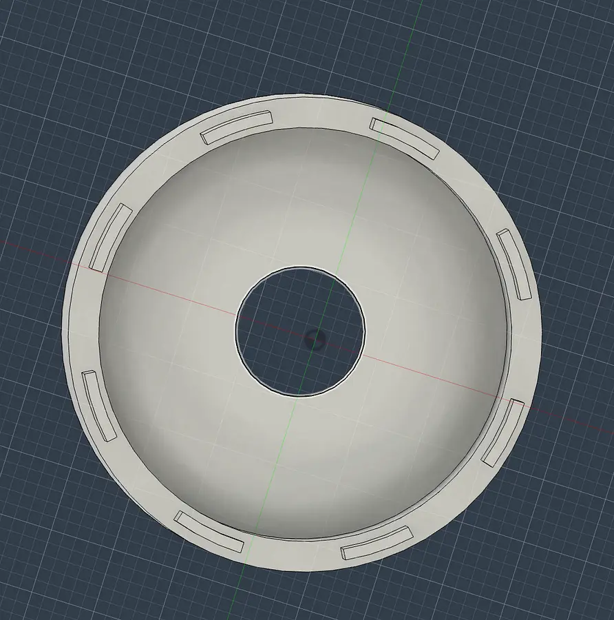

# Build Journal — 3-DOF Cycloidal Robotic Arm

I finished up the assembaly and everything should be complete now hoping to get funding now. Also pulled a free model from online for the gripper.

0

1

1

8

•••
Open comments for this post

@Aarnav on cycloidal_gearbox_robotic_arm · 9 days ago

2h 2m logged

---

fixed connection to allow movement and also made mount for FOC

0

1

1

6

•••
Open comments for this post

@Aarnav on cycloidal_gearbox_robotic_arm · 6 days ago

27m logged

---

worked on the connection from the base to the arm

0

1

1

9

•••
Open comments for this post

@Aarnav on cycloidal_gearbox_robotic_arm · 7 days ago

53m logged

---

worked on connecting arm components to the turning base

0

1

1

9

•••
Open comments for this post

@Aarnav on cycloidal_gearbox_robotic_arm · 8 days ago

1h 27m logged

---

I set up the ir sensor for the optical encoder for the base hopefully this works scrapped the idea of using the tiny magnets

0

1

1

8

•••
Open comments for this post

@Aarnav on cycloidal_gearbox_robotic_arm · 10 days ago

43m logged

---

working on encoder for base going to use these magnets

0

1

3

54

•••
Open comments for this post

@Aarnav on cycloidal_gearbox_robotic_arm · 12 days ago

1h 32m logged

---

set up the encoder and other part of the arm

0

1

2

35

•••
Open comments for this post

@Aarnav on cycloidal_gearbox_robotic_arm · 14 days ago

1h 23m logged

---

worked on building out the arm for the robotic arm

0

1

2

36

•••
Open comments for this post

@Aarnav on cycloidal_gearbox_robotic_arm · 14 days ago

41m logged

---

I finished the full two stage gearbox. The next stage is the actuator.

0

1

2

21

•••
Open comments for this post

@Aarnav on cycloidal_gearbox_robotic_arm · 15 days ago

1h 11m logged

---

worked on connecting the first stage to the second stage and designed the base for the output

 

0

1

3

43

•••
Open comments for this post

@Aarnav on cycloidal_gearbox_robotic_arm · 16 days ago

1h 3m logged

---

created the screw holes and figured out te output shaft set up the holes for the output to and verified everything worked together

0

1

2

37

•••
Open comments for this post

@Aarnav on cycloidal_gearbox_robotic_arm · 17 days ago

2h 9m logged

---

Fixed up the design ad bult the rollers our. Next going to design the part that recieves the motion

0

1

2

42

•••
Open comments for this post

@Aarnav on cycloidal_gearbox_robotic_arm · 18 days ago

1h 35m logged

---

I have fixed up the design removing unecessary parts and built the housing for the first stage for the cyloidal drive

0

1

2

33

•••
Open comments for this post

@Aarnav on cycloidal_gearbox_robotic_arm · 18 days ago

1h 26m logged

---

I have built the "crack shaft" of the cycloidal drive and I have also built the enclosure for the motor

  

0

1

2

45

•••
Open comments for this post

@Aarnav on cycloidal_gearbox_robotic_arm · 18 days ago

2h 27m logged
