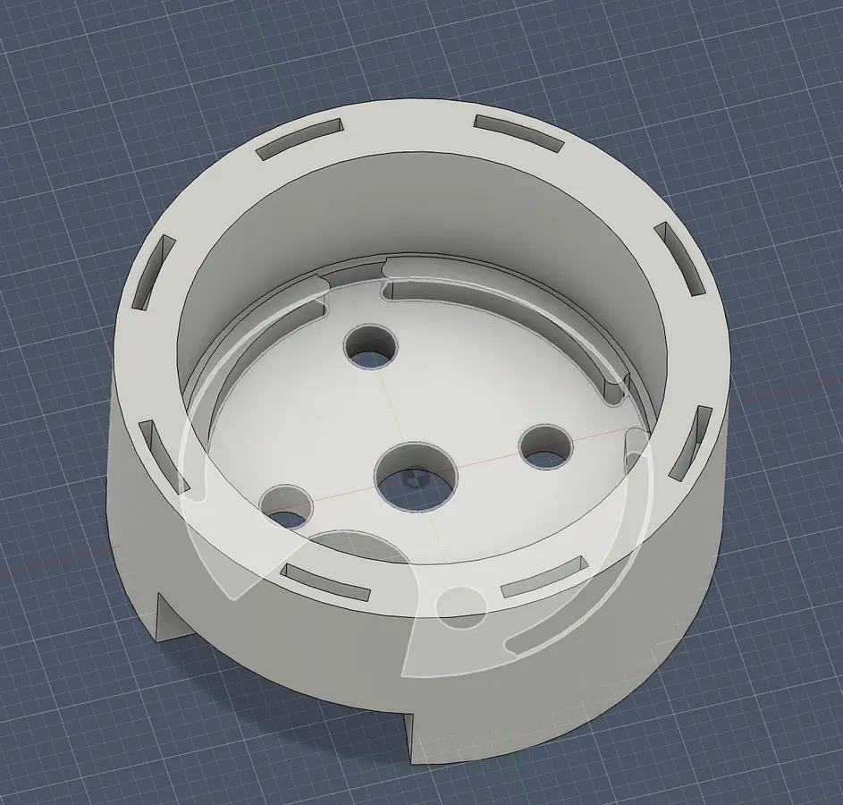
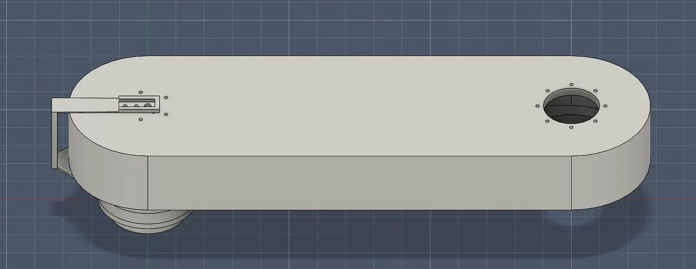
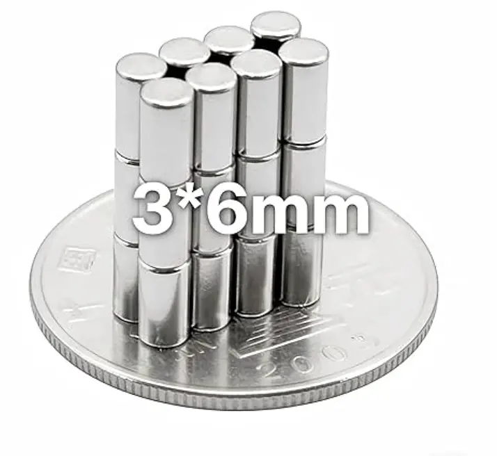
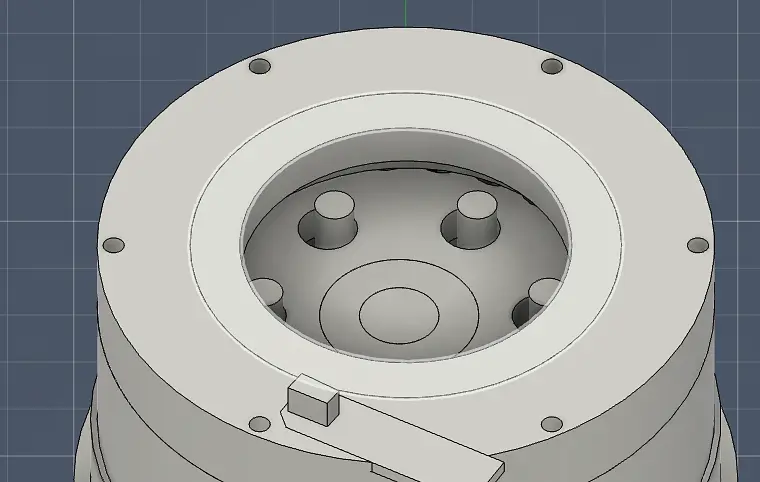
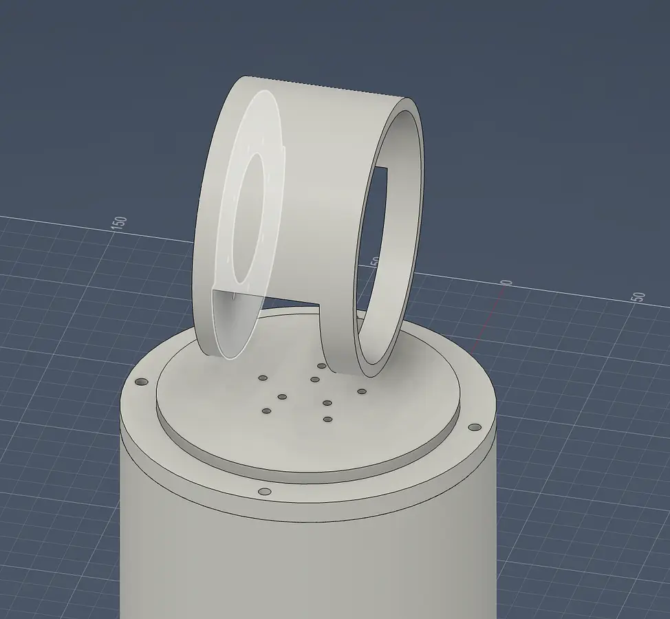
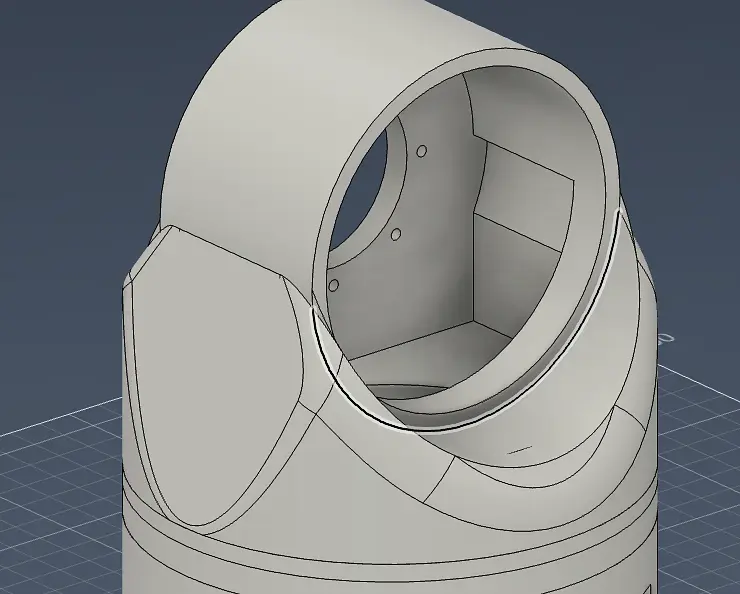

# Build Journal — 3-DOF Cycloidal Robotic Arm

## Day 1 — Crankshaft & Motor Enclosure
*2h 27m logged*

I have built the "crack shaft" of the cycloidal drive and I have also built the enclosure for the motor.

  

## Day 2 — First Stage Housing
*1h 26m logged*

I have fixed up the design removing unnecessary parts and built the housing for the first stage for the cycloidal drive.

## Day 3 — Rollers
*1h 35m logged*

Fixed up the design and built the rollers out. Next going to design the part that receives the motion.

## Day 4 — Output Shaft & Screw Holes
*2h 9m logged*

Created the screw holes and figured out the output shaft, set up the holes for the output too and verified everything worked together.

 

## Day 5 — Stage 1 to Stage 2 Coupling
*1h 3m logged*

Worked on connecting the first stage to the second stage and designed the base for the output.

## Day 6 — Two-Stage Gearbox Complete
*1h 11m logged*

I finished the full two stage gearbox. The next stage is the actuator.

## Day 7 — Arm Structure
*41m logged*

Worked on building out the arm for the robotic arm.

## Day 8 — Encoder Setup
*1h 23m logged*

Set up the encoder and other part of the arm.

## Day 9 — Base Encoder with Magnets
*1h 32m logged*

Working on encoder for base going to use these magnets.

## Day 10 — Optical Encoder Switch
*44m logged*

I set up the IR sensor for the optical encoder for the base, hopefully this works. Scrapped the idea of using the tiny magnets.

## Day 11 — Arm to Base Connection
*1h 27m logged*

Worked on connecting arm components to the turning base.

## Day 12 — Base to Arm Joint
*53m logged*

Worked on the connection from the base to the arm.

## Day 13 — FOC Mount & Movement
*27m logged*

Fixed connection to allow movement and also made mount for FOC.

## Day 14 — Final Assembly & Gripper
*2h 2m logged*

I finished up the assembly and everything should be complete now, hoping to get funding now. Also pulled a free model from online for the gripper.

---

**Total logged time:** ~19h 0m
