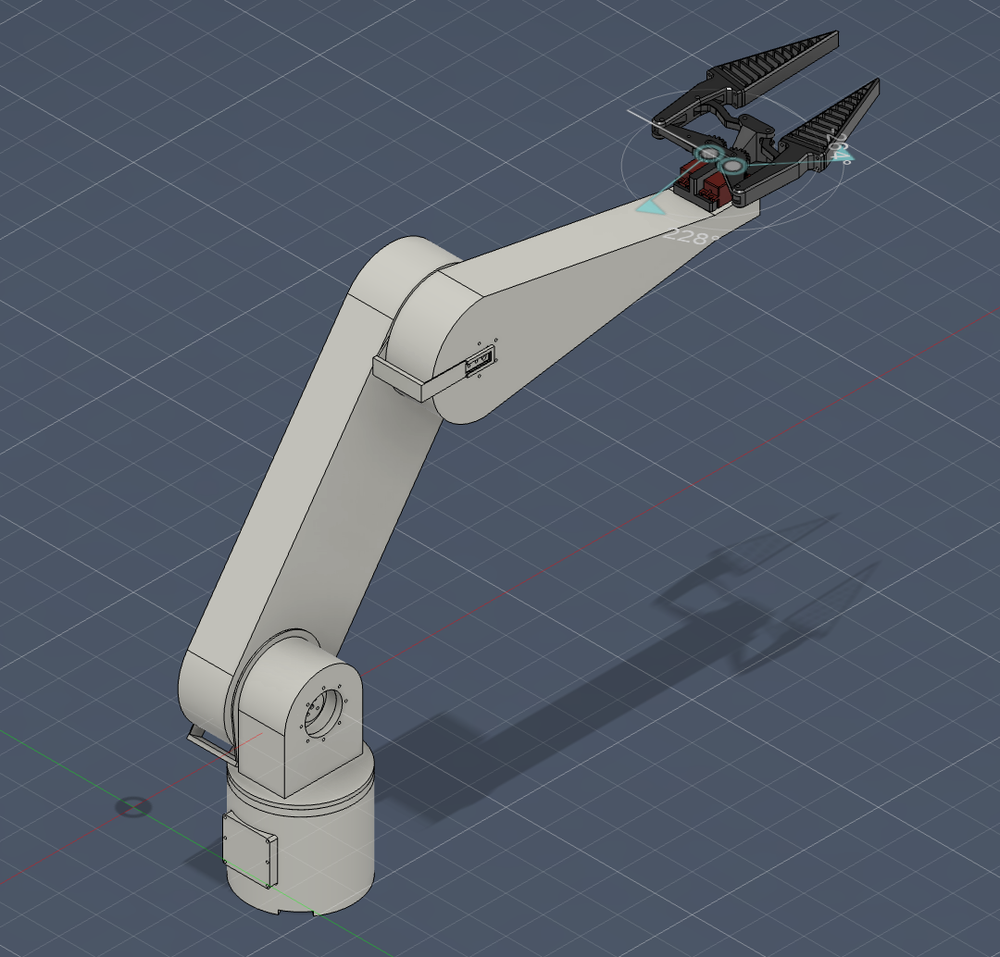
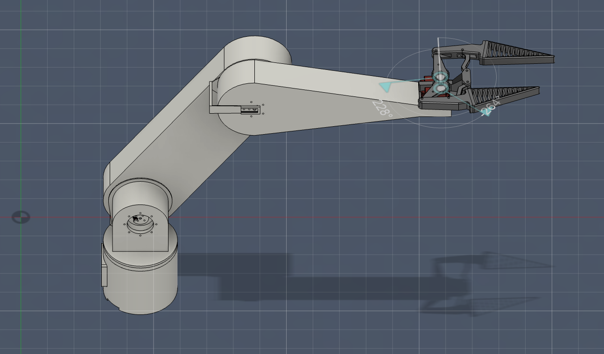
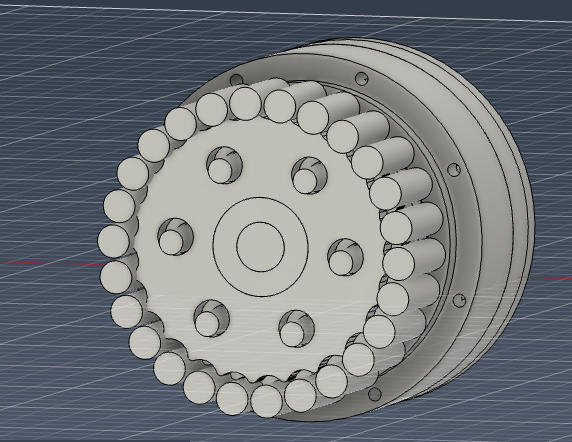
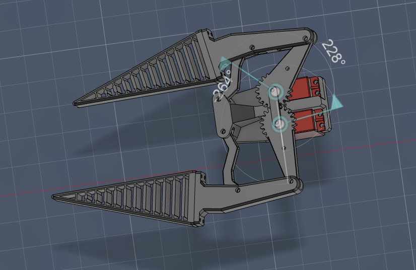

# 3-DOF Cycloidal Robotic Arm

A three-degree-of-freedom robotic arm driven by custom two-stage cycloidal gearboxes — designed from scratch using contracted cycloid profiles, 3D-printable housings, and absolute encoders on every joint. Built around spare EMAX RS2205 drone motors that needed a 500:1 reduction to be useful.

| | |
|---|---|
| **Motors** | EMAX RS2205 2300KV outrunner brushless × 3 |
| **Reduction** | 500:1 two-stage cycloidal (20:1 × 25:1) per joint |
| **Controllers** | MKS XDrive Mini (ODrive v3.6 clone) × 3 |
| **Computer** | Raspberry Pi 4 over CAN bus |
| **Reach** | ~830 mm |
| **Torque** | 10–15 Nm continuous, 30–44 Nm peak |
| **Feedback** | AS5048A magnetic (shoulder/elbow), TCRT5000 optical (base) |

 

---

## Cycloidal Gearbox Design

All three actuators use an identical two-stage cycloidal gearbox. Each stage has two cycloidal discs phased 180° apart on a shared eccentric crankshaft, cancelling vibration at high input speeds. The profiles use **contracted cycloids** — K1 = 0.618 (Stage 1) and K1 = 0.722 (Stage 2) — to prevent undercutting while keeping the discs printable on an FDM printer.



**Stage 1 (20:1):** 21 housing pins at 34 mm pitch radius, 62 mm disc OD, 6 mm thick. 6 output pins on 41 mm PCD.

**Stage 2 (25:1):** 26 housing pins at 36 mm pitch radius, 66 mm disc OD, 6 mm thick. 6 output pins on 43 mm PCD.

Both stages share the same eccentricity (1.0 mm), bearing sizes (6901ZZ for discs, 6809ZZ for flanges), and 8 mm hardened steel housing rods lubricated with lithium-complex grease.

---

## Gripper Design

Dual-servo adaptive jaw gripper with swept-back ridged fingers that conform around objects up to ~80 mm diameter. Driven by two DS3225 servos over GPIO PWM.

> **Gripper model by Tazer** — [patreon.com/TazerEngineering](http://patreon.com/TazerEngineering/posts/smart-gripper-149409228)



---

## Encoder Systems

- **Shoulder & elbow:** AS5048A 14-bit absolute magnetic (SPI, 16,384 CPR, 0.0219°/step). Reads a 6 mm diametrically magnetised magnet on the output shaft tip.
- **Base:** TCRT5000 reflective IR sensors reading a 40-pair quadrature disc (160 CPR) on the output flange face. Incremental — requires homing at startup.

---

## Electronics

Raspberry Pi 4 → CANable 2.0 → CAN bus → 3× MKS XDrive Mini (node IDs 0/1/2). 4S LiPo feeds the motor controllers directly; a 5V BEC powers the Pi, encoders, and gripper servos.

**Critical setup steps:**
- Flash **ODrive v0.5.1** (v0.5.6+ breaks these boards)
- **Desolder R57** on every MKS board (CAN transceiver fix)
- Set ghost axis (axis 1) to **CAN node ID 63** on each board

---

## Bill of Materials

| Category | Items | Est. Cost |
|----------|-------|-----------|
| Motors & controllers | 3× RS2205, 3× MKS XDrive Mini, CANable 2.0, CAN cables | ~$163 |
| Computing & power | Raspberry Pi 4, 32 GB SD, 4S LiPo 5000 mAh, BEC, charger, connectors, fuse | ~$140 |
| Encoders | 2× AS5048A, magnets, 2× TCRT5000, resistors | ~$22 |
| Gripper | 2× DS3225 servo, extension cables | ~$44 |
| Bearings | 12× 6901ZZ, 12× 6809ZZ, lazy susan | ~$53 |
| Hardware | 141× 8 mm rods, 18× 6 mm rods, M3/M2/M4 fasteners, grease | ~$43 |
| Wiring | 14 AWG + 22 AWG silicone, heat shrink, connectors | ~$15 |
| **Total** | | **~$356** |

Full CSV with links: [robot_arm_parts_list.csv](robot_arm_parts_list.csv)

---

## Load Analysis (Worst Case — Arm Fully Extended)

| Component | Mass | Torque at Shoulder |
|-----------|------|-------------------|
| Arm segment 1 | ~250 g | 0.51 Nm |
| Elbow gearbox + motor | ~230 g | 0.94 Nm |
| Arm segment 2 + encoder | ~260 g | 1.53 Nm |
| Gripper | ~100 g | 0.77 Nm |
| Payload | ~500 g | 4.07 Nm |
| **Total** | **~1.34 kg** | **~7.82 Nm** (~28% headroom) |

---

## Quick Start

```bash
sudo apt update && sudo apt upgrade -y
sudo apt install python3-pip python3-venv can-utils -y
pip install odrive==0.5.1 python-can
sudo ip link set can0 up type can bitrate 500000
sudo ifconfig can0 up
```

```python
import odrive
odrv_base = odrive.find_any(path='can:can0:0')
odrv_shoulder = odrive.find_any(path='can:can0:1')
odrv_elbow = odrive.find_any(path='can:can0:2')
odrv_base.axis0.requested_state = AXIS_STATE_CLOSED_LOOP_CONTROL
```

---

## Repository Structure

```
├── assets/            # Images and demo video
├── CAD/               # Full STEP assembly
├── PCB/               # Circuit board designs (TBD)
├── firmware/          # Firmware (TBD)
├── JOURNAL.md         # Build log
└── README.md
```

---

## License

Open engineering reference — use and modify freely.
