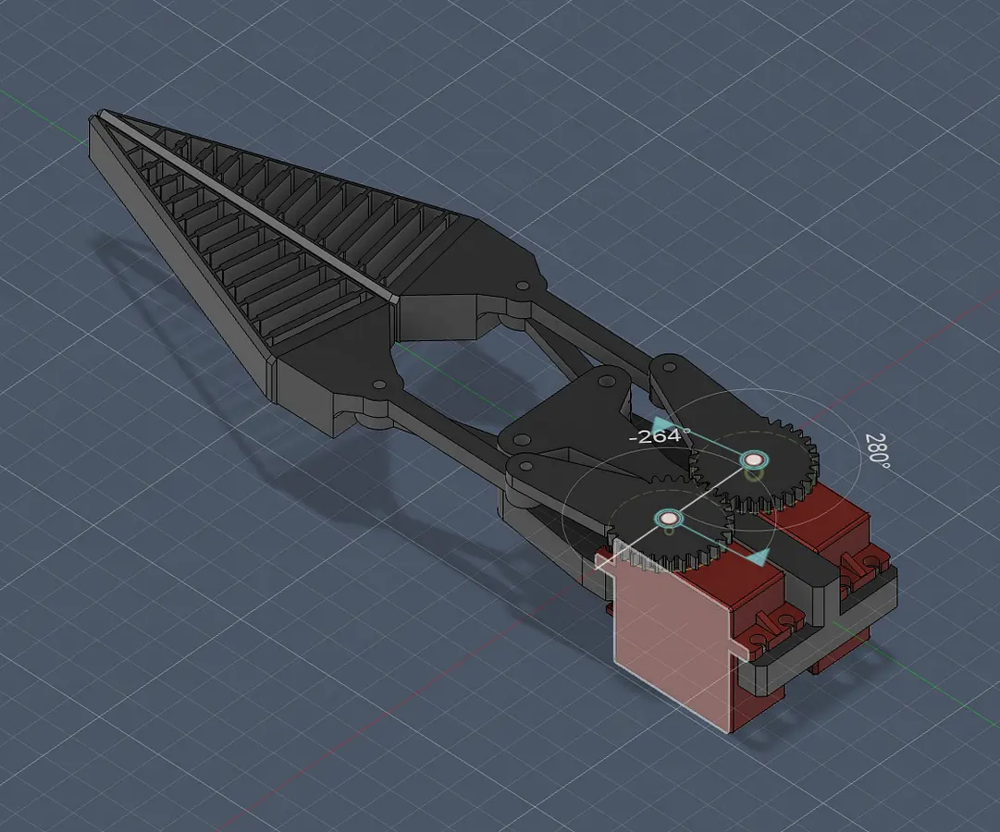

# 3-DOF Cycloidal Robotic Arm

A three-degree-of-freedom robotic arm driven by custom two-stage cycloidal gearboxes. Designed from the base of 3 RS2205 motors I had laying at home. Utilized contracted cycloids for the discs and most should be 3d printable except for the electronics and the bearings. Encoders on every joint for precision. @ stage cycloidal gearbox for a 500:1 reduction becuase the drone motors spin very fast. I wanted to design this because it is cool.

| | |
|---|---|
| **Motors** | EMAX RS2205 2300KV outrunner brushless × 3 |
| **Reduction** | 500:1 two-stage cycloidal (20:1 × 25:1) per joint |
| **Controllers** | MKS XDrive Mini (ODrive v3.6 clone) × 3 |
| **Computer** | Raspberry Pi 4 over CAN bus |
| **Reach** | ~830 mm (2 × 415 mm segments) |
| **Torque** | 10–15 Nm continuous, 30–44 Nm peak per joint |
| **Feedback** | AS5048A 14-bit magnetic (shoulder/elbow), TCRT5000 optical (base) |
| **Print material** | PLA+ or ABS |

 

---

## Table of Contents

- [Cycloidal Gearbox](#cycloidal-gearbox)
- [Gripper](#gripper)
- [Encoder Systems](#encoder-systems)
- [Electronics](#electronics)
- [Rotating Base](#rotating-base)
- [Load Analysis](#load-analysis)
- [Print Notes](#print-notes)
- [Assembly Sequence](#assembly-sequence)
- [Testing & Troubleshooting](#testing--troubleshooting)
- [Bill of Materials](#bill-of-materials)
- [Quick Start](#quick-start)
- [Repository Structure](#repository-structure)

---

## Cycloidal Gearbox

All of the actuators us a modified version of the cycloidal gearboc I designed. Each gearbox has two cycloids out of phase by 180 degrees so the gearbox doesnt vibrae itself apart. These share an eccentric crankshaft. We use contracted cyloids to prevent undercutting with K1 = 0.618 (Stage 1) and K1 = 0.722 (Stage 2. 


### Stage 1 — 20:1

| Parameter | Value |
|-----------|-------|
| Disc lobes / housing pins | 20 / 21 |
| Housing rod diameter | 8 mm hardened steel |
| Housing pin pitch radius | 34 mm |
| Disc outer diameter | 62 mm |
| Disc thickness | 6 mm |
| Output pins | 6 × 6 mm on 41 mm PCD |
| Eccentricity | 1.0 mm |
| Centre bearing | 6901ZZ (12×24×6) |
| Flange bearing | 6809ZZ (45×58×7) |

### Stage 2 — 25:1

| Parameter | Value |
|-----------|-------|
| Disc lobes / housing pins | 25 / 26 |
| Housing rod diameter | 8 mm hardened steel |
| Housing pin pitch radius | 36 mm |
| Disc outer diameter | 66 mm |
| Disc thickness | 6 mm |
| Output pins | 6 × 6 mm on 43 mm PCD |
| Eccentricity | 1.0 mm |
| Centre bearing | 6901ZZ (12×24×6) |
| Flange bearing | 6809ZZ (45×58×7) |

### Axial Stack Height (One Gearbox)

| Layer | Thickness |
|-------|-----------|
| Motor bell adapter | 8 mm |
| Bottom retaining plate | 3 mm |
| Bottom spacer (S1) | 3 mm |
| Cycloidal disc 1 (S1) | 6 mm |
| Sandwich spacer (S1) | 2 mm |
| Cycloidal disc 2 (S1) | 6 mm |
| Top retaining plate | 3 mm |
| Bottom spacer (S2) | 3 mm |
| Cycloidal disc 1 (S2) | 6 mm |
| Sandwich spacer (S2) | 2 mm |
| Cycloidal disc 2 (S2) | 6 mm |
| Top retaining plate | 3 mm |
| Output flange + bearing | 8 mm |
| **Total (excl. motor)** | **~59 mm** |

### Two-Disc Balance

The gearbox contains two contracted cycloids per stage with them out of phase by 180 degrees to cancel out the immense lateral forces that would shake the gearbox apart at 34,000 rpm.


---

## Gripper

The gripper has a dual servo design for maximum power mounted at the end of the robotoc arm. The arms use a shape that allowsthe arms to mold around the objects ensuring a firm grip this part should be printed in tpu for it to bend around opjects. I modified a design that I found off of the internet to fit my arm properly and is serperate in the cad files under the name gripper.

> **Gripper model by Tazer** — [patreon.com/TazerEngineering](http://patreon.com/TazerEngineering/posts/smart-gripper-149409228)



| Parameter | Value |
|-----------|-------|
| Actuation | 2 × DS3225 servo, antagonistic |
| Stall torque | ~25 kg·cm @ 6.8 V |
| Control | GPIO PWM, 50 Hz, 500–2500 µs |
| Jaw travel | ~0–90° per finger |
| Power | 5 V BEC (not Pi onboard 5 V) |

---

## Encoder Systems

On the base I could not fi=t a magnetic encoder becuase I have an outrunner motor so I decided to use an ir sensor to make a makeshift optical encoder. The actual weight goes on a lazy susan bearing because if it went on the gearbox it would destroy the gearbox. 

**Base joint** — TCRT5000 reflective IR sensors reading a printed 40-pair quadrature disc (160 CPR) on the output flange face. The base centre is occupied by the rotating platform, so there's no accessible shaft end for a magnetic encoder. Incremental — requires a homing routine at startup.

For the other 2 joints I use a magnetic encoder as it is much easier to set up and mroe precise. Yjis is mounted at the end of the arm.

**Shoulder & elbow** — AS5048A 14-bit absolute magnetic encoder (16,384 CPR, 0.0219°/step). Reads a 6 mm diametrically magnetised neodymium magnet on the output shaft tip over SPI. Knows position on power-up — no homing needed.

---

## Electronics

```
Raspberry Pi 4 → CANable 2.0 → CAN bus (500 kbit/s) → MKS #1 (ID 0, base)
                                                       → MKS #2 (ID 1, shoulder)
                                                       → MKS #3 (ID 2, elbow)
4S LiPo → 20A fuse → 3× MKS XDrive Mini (direct)
                  → 5V BEC → Pi + encoders + gripper servos
```

### Critical Setup

- **ODrive firmware v0.5.1 only** — v0.5.6+ breaks motor output on these boards
- **Desolder R57** on every MKS board (CAN transceiver fix — forces standby mode otherwise)
- Set ghost axis (axis 1) → **CAN node ID 63** on each board to prevent bus conflicts

### ODrive Configuration

```python
# Motor
axis0.motor.config.motor_type = MOTOR_TYPE_HIGH_CURRENT
axis0.motor.config.pole_pairs = 7
axis0.motor.config.current_lim = 20
axis0.motor.config.calibration_current = 5

# AS5048A (shoulder/elbow)
axis0.encoder.config.mode = ENCODER_MODE_SPI_ABS_AMS
axis0.encoder.config.cpr = 16384

# TCRT5000 (base)
axis0.encoder.config.mode = ENCODER_MODE_INCREMENTAL
axis0.encoder.config.cpr = 160
axis0.encoder.config.bandwidth = 100
```

---

## Rotating Base

The base gearbox uses the same two-stage cycloidal drive but drives a horizontal rotating platform instead of an output shaft. A 100 mm lazy susan bearing carries all axial load (arm weight + payload); the six gearbox output pins handle torque only — clean load path separation prevents bending fatigue.

---

## Load Analysis

Worst case: arm fully extended horizontally.

| Load | Mass | Torque at Shoulder |
|------|------|--------------------|
| Arm segment 1 | ~250 g | 0.51 Nm |
| Elbow gearbox + motor | ~230 g | 0.94 Nm |
| Arm segment 2 + encoder | ~260 g | 1.53 Nm |
| Gripper | ~100 g | 0.77 Nm |
| Payload (target) | ~500 g | 4.07 Nm |
| **Total** | **~1.34 kg** | **~7.82 Nm** |

With 10–15 Nm continuous capacity, the shoulder has ~28% headroom.

---

## Print Notes

| Part | Orientation |
|------|-------------|
| Housing rings | Bore axis vertical (upright) |
| Cycloidal discs | Flat on bed |
| Retaining plates | Flat |
| Arm segments | Lengthwise, long axis horizontal |

**Tolerances:** FDM holes print 0.2–0.4 mm undersized. Test before printing full housings. Disc centre bore: print at 23.95 mm for 6901ZZ press fit. Output pin holes: print at 5.85 mm for 6 mm rod press fit.

**Lubrication:** Lithium-complex grease (Super Lube) on all housing rods. No petroleum-based lubricants on PLA — causes stress cracking. the lubrication is necessary becuase we are using rods which have higher friction that the bearings that you would usually use.

---


---

## License

Open engineering reference — use and modify freely.
